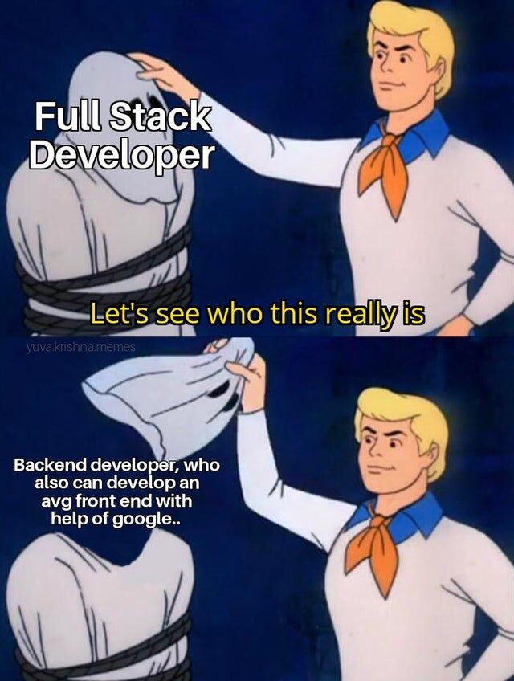
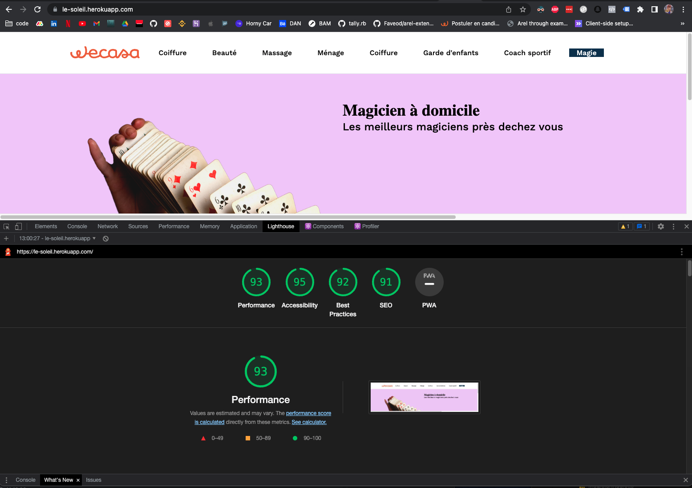

## __Coucou toi ! 🙋‍♂️__

J'ai fais ce projet pour deux raisons :

1. Je voulais faire une application me permettant d'appuyer ma candidature spontannée chez Wecasa
2. Je voulais VRAIMENT tester une lib front qui s'appelle [InertiaJS](https://inertiajs.com/who-is-it-for)

Du coup... autant lier l'utile à l'agréable 😇

### Qui suis-je 🕺 

Je m'appelle Hugo, j'ai 20 ans, et je suis actuellement étudiant dans une école qui s'appelle l'ETNA en Master 1.

J'ai appris à taper mes premières lignes (de code) quand j'avais 12 ans en python grâce au site du zéro.
En grandissant j'ai touché à un grand scope de langages -> C, CPP, JAVA, Bash, Php, Python, Lisp, Ruby, JS, Swift.

Je dois dire que je suis tombé en amour pour Ruby. Depuis 2 ans je ne code presque qu'en Ruby et je voue à devenir expert RubyOnRails.

Cela fais de moi un développeur Full-Stack...

<div style="width: 25%; margin: auto">


</div>

Plus sérieusement, j'ai appris à faire des apps en Rails grâce à mon alternance : [Study Advisor](https://www.welcometothejungle.com/fr/companies/study-advisor/jobs/developer-fullstack-ruby-h-f_paris)

J'y suis depuis maintenant 2 ans et pendant ces deux années j'ai énormément appris. Que ce soit d'un point de vu entrepreneurial ou technique, j'ai énormément grandis.

J'ai d'ailleurs pu mettre à profit mes compétences fraîchement acquises pour me lancer en [freelance](https://www.malt.fr/profile/hugovast)

Aujourd'hui j'ai deux ans d'expériences, une dizaine de projets Rails à mon actif et j'aimerai vraiment trouver une nouvelle expérience pour mon M2.


### _Mais du coup le projet... c'est quoi ?_ 🧐

Pas de panique yannick je vais tout t'expliquer !

Comme dit plus haut, j'aimerai beaucoup rejoindre la team tech de Wecasa. Mais je me voyais mal faire une candidature spontannée sans rien.

Très simplement : je suis partis de leur concept, je l'ai étendu sous forme de POC

_Et si on rajoutais la catégorie magicien à domicile ?_ 🧙‍♂️

Je sais. D'un point de vue produit c'est très éclaté c'est clairement pas une catégorie game changer dans le CA 📉. Mais. Cela reste
réaliste, en accord avec le produit de base, donc pourquoi pas ?  

### Les restrictions du projet 📐

Le projet comporte 5 pages:
- La première partie d'une landing page wecasa pour prendre rendez-vous avec un magicien
- Input adresse
- Choix des prestations des magiciens
- Choix du magicien
- Confirmation du rendez-vous avec le prestataire

Certains composants me demanderai trop de temps pour reproduire le comportement exactement comme sur le site wecasa : j'ai pris
la décision d'accepter que l'app ne serai pas parfaite en terme de style et rendre un projet abouti plutôt que quelques composants parfaits.

J'ai fais le projet en 2 jours, lors du week-end de pâques =, comme si c'étais un hackaton. Tout ça sans savoir si j'allais finalement réussir le projet.

Même s'il n'est pas parfait je suis très content d'être arrivé jusqu'au bout. 
Si j'avais eu plus de temps j'aurai pu rajouter quelques fonctionnalités simple

## Setup 👨‍🏭

ruby 3.0.1

yarn 1.22.10

```
bundle && yarn && rails db:setup && bin/dev
```

Et si vous voulez pas perdre votre temps je l'ai deploy sur https://le-soleil.herokuapp.com/


### Pourquoi te casser les pieds avec InertiaJS ? 👨‍🔬

Étant développeur full-stack mais MAJORITAIREMENT orienté back, c'est vrai que cette app ne met pas tellement en valeur mes compétences...

**Et pourtant ⚠️ !**

Si je vous disais qu'il existais un monde où, avec votre app en rails vous pouviez avoir des performances dignes d'un front en Nuxt... sans devoir passer par du REST !

Certains dirait que je suis fou et POURTANT. Une solution pour les gouverner toutes existe bel et bien -> InertiaJS.
https://github.com/inertiajs/inertia

Leur promesse est de pouvoir tenir une architecture monolithique avec un framework Javascript de façon optimisée. Dans notre cas on va partir sur React mais il est possible
d'utiliser Vue2/3 et Svelte. 🥰

Il existe déjà des solutions pour utiliser React sur Rails -> [sans gem](https://www.digitalocean.com/community/tutorials/how-to-set-up-a-ruby-on-rails-project-with-a-react-frontend), [avec gem](https://github.com/reactjs/react-rails)...
J'ai toujours trouvé l'utilisation relativement complexe et lourde pour une application Rails.

Lors de l'utilisation d'Inertia tous mes doutes se sont envolés. L'utilisation est stupidement simple. Pas besoin de routeur. Très épuré. Et la cerise sur le gateau est apparue quand j'ai déployé l'application sur Heroku lors du lighthouse

<div style="width: 50%; margin: auto">


</div>

Sans la moindre optimisation et sans vraiment pouser loins les concepts d'Inertia j'ai déjà un site reposant entièrement sur React qui est bien optimisé !

Je suis vraiment content d'avoir pu tester cette techno et je pense vraiment m'en resservir dans le futur.
